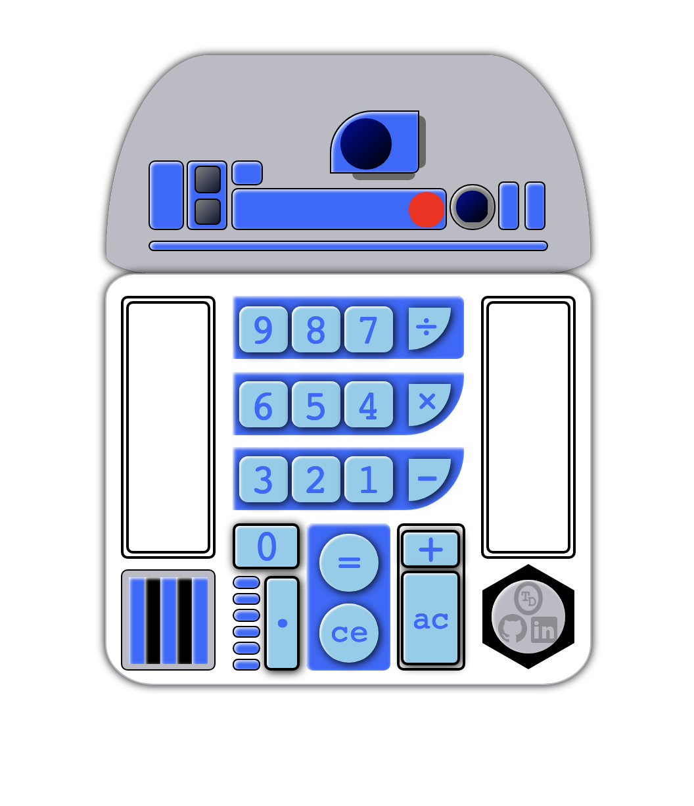

# There were not enough Star Wars themed Calculator Apps on the web...

Working version [here](https://calculator-r2d2.herokuapp.com/)

  

I was having fun with this, so there are easter eggs. See these six secret blue buttons...

----

This project was early in my software dev learning. 
It is fun to see how far I've come since this project, (it has just a hint of es6). The code could be cleaner, and it would work great as a react app, but it still works great (no dependencies) and is a nice memory lane thing. I am proud of how the visual turned out.

Below I have included some of my notes from way back when.

## CSS first approach
I decided to try and push my CSS skills, and started this project with the visual frame. It has some funky shapes and a lot of little components.
I am quite happy with how R2D2 visually turned out, but I discovered some cross-browser compatibility issues with R2D2's head -> this line: border-radius: 65% 65% 50% 50% / 270% 270% 30% 30%;
It works in chrome, but gets a little chopped in mozilla. I didn't even look at IE and hopefully nobody ever does.
It was a good learning experience.

## Vanilla Javascript
My decision to abandon JQuery and learn Javascript from the ground up was painful. But I am very grateful that I am learning how it all comes together.
I have spent a lot of time reading docs, and am learning the benefits of the Model View Controller Model. I set up the model first and tested it in the console. The logic took some fiddling, but it works!
The buttons and visualisation was a trickier for me, especially without jquery and because I built the HTML CSS first, but knowing that the functionality is working (and is tested) prior to connecting listeners to buttons to logic helps. The model first, then pretty it up for the user.

There were some challenges getting the display to dynamically resize the font depending on how wide the number was.
